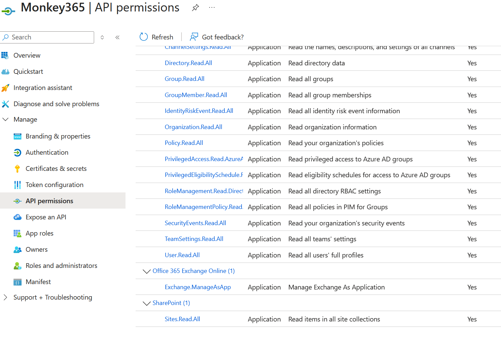

# Getting Started

To set up a service principal for use with Monkey365, you’ll need to follow the following steps:

# Step-by-Step Guide: Configuring a Service Principal for Monkey365

1. Register an Application in Microsoft Entra ID
	- Go to the Microsoft Entra admin center.
    - Navigate to Applications > App registrations > New registration.
    - Provide a name (e.g., **Monkey365**).
    - Choose the appropriate Supported account types (recommended "Accounts in this organizational directory only").
    - Click Register.
	
2. Choose Your Authentication Method
	- Option A: Create a Client Secret
		- Go to Certificates & secrets > Client secrets.
		- Click New client secret, add a description, and choose an expiration.
		- Click Add, then copy the secret value immediately as it won't be shown again.
	- Option B: Upload a Certificate (Recommended for enhanced security)
		- Go to Certificates & secrets > Certificates.
		- Click Upload certificate.
		- Select your .cer file containing the public key of your certificate.
		- Click Add to register the certificate.
		???+ note
			The private key should be securely stored on the system where Monkey365 runs. Monkey365 must be configured to use this certificate for authentication.

3. Assign API Permissions
	- Go to API permissions > Add a permission.
	- Add the necessary **application permissions** for Monkey365:
		- **Microsoft Graph** (Select Microsoft Graph API under *Commonly used Microsoft APIs*)
			- User.Read.All,
			- Application.Read.All,
			- Policy.Read.All,
			- Organization.Read.All,
			- RoleManagement.Read.Directory,
			- GroupMember.Read.All,
			- Directory.Read.All,
			- PrivilegedEligibilitySchedule.Read.AzureADGroup,
			- PrivilegedAccess.Read.AzureADGroup,
			- RoleManagementPolicy.Read.AzureADGroup,
			- Group.Read.All,
			- SecurityEvents.Read.All,
			- IdentityRiskEvent.Read.All
			- UserAuthenticationMethod.Read.All
			???+ note
				For Microsoft Teams, the following permissions should be included: 
				
					* AppCatalog.Read.All
					* Channel.ReadBasic.All
					* ChannelMember.Read.All
					* ChannelSettings.Read.All
					* TeamSettings.Read.All
				
		- **Exchange Online** (Select Office 365 Exchange Online API under *APIs my organization uses*)
			- Exchange.ManageAsApp
		- **SharePoint Online** (Select SharePoint API under *Commonly used Microsoft APIs*)
			- Sites.FullControl.All

	
	
	- Don't forget to click Grant admin consent for your tenant.

4. Assign a Role to the Service Principal
	To enable Monkey365 to access Exchange Online and SharePoint Online, elevated permissions are required. This means you must assign an appropriate role to the service principal:
	* Go to Microsoft Entra > Roles and administrators.
	* Select a role that grants the necessary access:
		* For Exchange Online, select Global Reader
		* For SharePoint Online, select SharePoint Administrator
	* Search for your registered app and assign the role.

This step ensures the service principal has sufficient privileges to interact with the required Microsoft 365 services securely and effectively.

???+ note
	You will need the following for Monkey365:
	
	- Tenant ID: Found under Azure Entra ID > Overview.
	- Client ID: From the app registration overview.
	- Client Secret or Certificate: The one you created earlier.
	
# Microsoft Fabric

???+ note
	Unlike other services, Microsoft Fabric requires that the application **must not have any delegated or application permissions** assigned. If the app has permissions (especially admin-consent-required ones), it will be blocked from accessing Fabric admin APIs—even if other steps are correctly configured.

To enable Service Principal Authentication in Microsoft Fabric:

1. Create or Use a Microsoft Entra App
	- Navigate to Microsoft Entra ID > App registrations.
	- Create a new app or select an existing one.
	- Note the Application (client) ID, as you'll need it later.

2. Choose Your Authentication Method
	- Option A: Create a Client Secret
		- Go to Certificates & secrets > Client secrets.
		- Click New client secret, add a description, and choose an expiration.
		- Click Add, then copy the secret value immediately as it won't be shown again.
	- Option B: Upload a Certificate (Recommended for enhanced security)
		- Go to Certificates & secrets > Certificates.
		- Click Upload certificate.
		- Select your .cer file containing the public key of your certificate.
		- Click Add to register the certificate.
		???+ note
			The private key should be securely stored on the system where Monkey365 runs. Monkey365 must be configured to use this certificate for authentication.

3. Create a Microsoft Entra Security Group
	- Go to Microsoft Entra ID > Groups.
	- Create a new group and set Group type to **Security**.
	- Name it something like FabricMonkey365SPGroup.

4. Add the App to the Security Group
	- Open the security group you just created.
	- Select Add Members.
	- Add your service principal (app ID) as a member.

5. Enable Admin API Access in Microsoft Fabric
	- Sign in to the Microsoft Fabric Admin Portal.
	- You must be a Fabric admin to access tenant settings.
	- Under Admin API settings, toggle:
		- *Service principals can access read-only admin APIs*
		- *Service principals can access admin APIs used for update*
	- Choose Specific security groups and enter the group name from Step 3.
	- Click Apply.

You can now use Monkey365 using the following command as a example:

```PowerShell
$param = @{
    ClientId = '00000000-0000-0000-0000-000000000000';
    certificate = 'C:\monkey365\testapp.pfx';
    CertFilePassword = ("MySuperCertSecret" | ConvertTo-SecureString -AsPlainText -Force);
    Instance = 'Microsoft365';
    Collect = 'SharePointOnline','MicrosoftFabric';
    TenantID = '00000000-0000-0000-0000-000000000000';
	PowerBIClientId = '00000000-0000-0000-0000-000000000000';
    PowerBICertificateFile = 'C:\monkey365\powerBi.pfx';
    PowerBICertificatePassword = ("MySuperPassword" | ConvertTo-SecureString -AsPlainText -Force);
    ExportTo = @("HTML");
}
Invoke-Monkey365 @param
```


## Authentication limits

Some Microsoft 365 services — such as **SharePoint Online** — do not support client credential authentication via Client-Side Object Model (CSOM). This means that even with a properly configured service principal, access to certain endpoints may be restricted unless alternative authentication methods are used.

Be sure to review the [authentication requirements for each service](../supported_auth_methods_byapp.md) Monkey365 interacts with, and adjust your configuration accordingly.

## References

<a href='https://learn.microsoft.com/en-us/sharepoint/dev/solution-guidance/security-apponly-azuread' target='_blank'>https://learn.microsoft.com/en-us/sharepoint/dev/solution-guidance/security-apponly-azuread</a>

<a href='https://learn.microsoft.com/en-us/entra/identity-platform/quickstart-register-app' target='_blank'>https://learn.microsoft.com/en-us/entra/identity-platform/quickstart-register-app</a>

<a href='https://learn.microsoft.com/en-us/powershell/exchange/app-only-auth-powershell-v2?view=exchange-ps' target='_blank'>https://learn.microsoft.com/en-us/powershell/exchange/app-only-auth-powershell-v2?view=exchange-ps</a>

<a href='https://learn.microsoft.com/en-us/fabric/admin/enable-service-principal-admin-apis' target='_blank'>https://learn.microsoft.com/en-us/fabric/admin/enable-service-principal-admin-apis</a>


