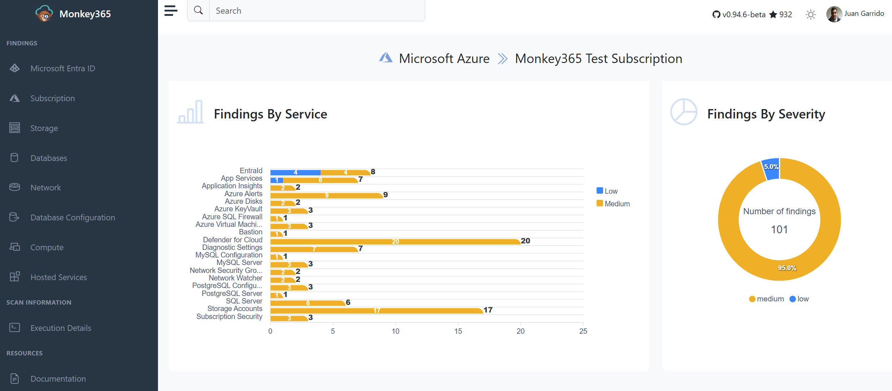
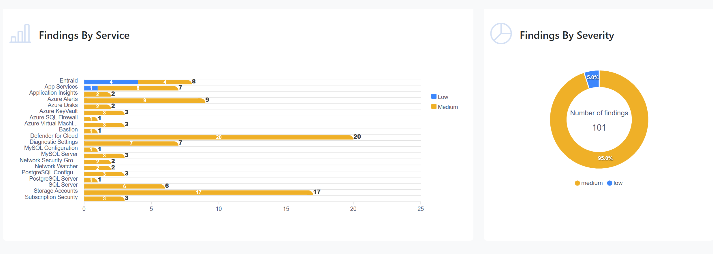
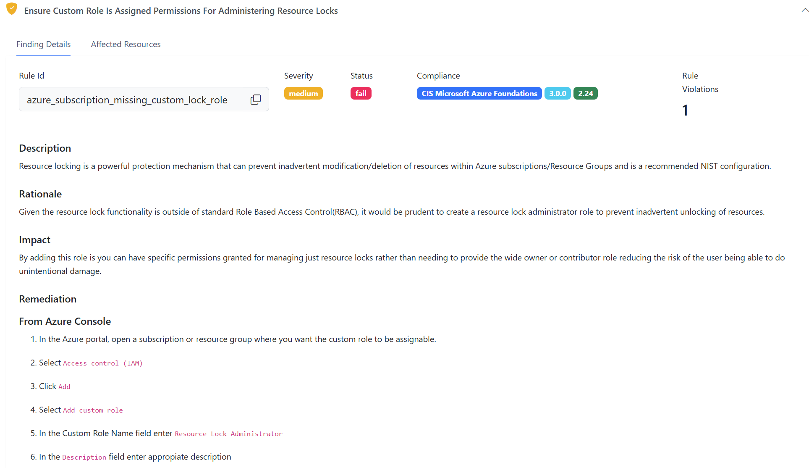
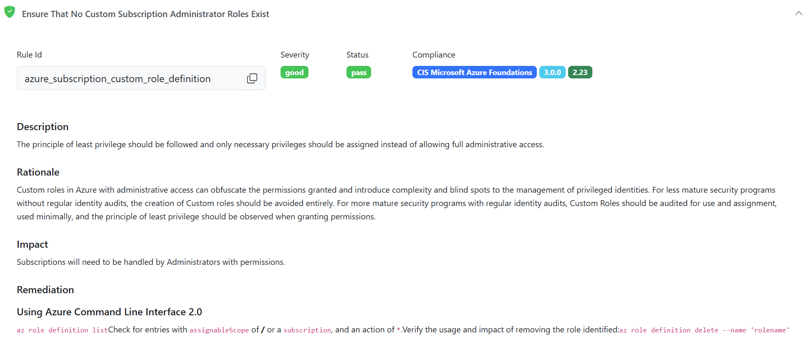
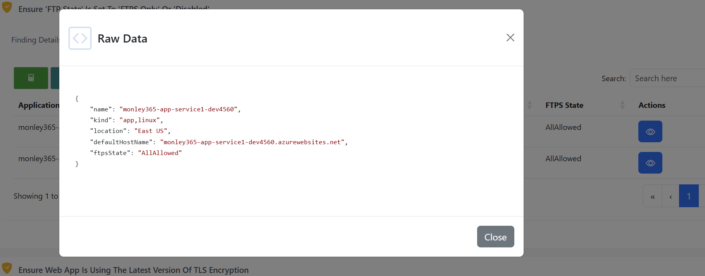

Monkey365 provides an internal module which provides methods to convert internal data to HTML format. Also, internal module adds additional support to Markdown syntax with <a href='https://github.com/xoofx/markdig' target='_blank'>Markdig</a>.



The following example can be used to export all data to an HTML file.

``` powershell
$param = @{
    Instance = 'Azure';
    Collect = 'All';
    PromptBehavior = 'SelectAccount';
    AllSubscriptions = $true;
    TenantID = '00000000-0000-0000-0000-000000000000';
    ExportTo = 'HTML';
}
Invoke-Monkey365 @param
```

## Overview

The HTML report is entirely independent of the JSON or CSV report. As a result, all components are designed to be compatible with both Microsoft 365 and Azure providers. The HTML report will adjust the rendering of various components based on the content.

## Exporting options

Monkey365 HTML reports uses CDN (jsDelivr) to load assets by default. The base [configuration](../configuration/configuration-file.md) is as follows:

```json 
"htmlSettings": {
	"convertPassFindingToGood": true,
	"assetsRepository":"https://github.com/silverhack/monkey365assets",
	"localHtmlReport": {
		"assetsPath": "localassets",
		"enabled": "false"
	},
	"htmlReportFromCDN": "true"
},
```
As an alternative, you can enable the legacy mode, which will download a local copy of all the assets and set local links within the report.

???+ note
	Downloading assets significantly increases the size of a report. The size can exceed 20MB.

### In-House CDN

There is an option to use an in-house CDN by configuring CDN URL via `assetsRepository` property (defaults to https://github.com/silverhack/monkey365assets).

* Download assets via GitHub
* Unpack it and upload files into your CDN (e.g. private GitHub repository)
* Set the `assetsRepository`property to new CDN link

## Compliance

A [ruleset](../security_checks/overview.md) allows you to organize multiple rules that work towards a common goal. These rulesets represent your governance rules that you want Monkey365 to analyze for you. Monkey365 will alert you when a rule is violated.

Monkey365 includes a variety of default rules and rulesets that can be modified. Additionally, you can configure your own compliance rules.

The HTML report can be comprised of various components.

**Findings Summary**: As indicated in the below picture, the "Findings Summary" shows a breakdown of rule violations in the charts "Issues by service", "Issues by severity".



**Dashboard Table**: As shown in the image below, the "Dashboard Table" provides an overview of the scan operation, including the number of rules, the service name, and the current trend of violations.


**Finding Cards**: As shown in the image below, a `Finding card` provides an overview of the rule, including the severity, rule name, description, a brief summary of the general description, and the rationale of the rule.



If the query does not meet the configured value, then the card will have a button that can be used to check the corresponding violations, as indicated in the above picture (position 1).

If the rule's query meets the configured value, the level will be changed to `good`, as shown below:



## Customize HTML

A Monkey365 report uses JSON-like configuration objects to visualize data in a variety of ways. This approach makes it easy to modify and combine tables, style them, and make them interactive with buttons. You can use your favorite text editor in order to modify these configuration files.

## HTML Configuration Files Location

All the table formats are stored within JSON rules and data is rendered with ```JQuery DataTables```. Basic table and table ```as list ``` are the available formats. Please, note that not all features of HTML tables are supported.

## HTML Table examples

### Table As List

Take for example the following code extracted from the <a href='https://github.com/silverhack/monkey365/blob/main/rules/findings/Azure/App%20Services/CIS1.4/azure-app-services-ad-managed-identity-missing.json' target='_blank'>azure-app-services-ad-managed-identity-missing.json</a> Monkey365 rule.

``` json
{
	"data": {
        "properties": {
          "name": "Application Name",
          "kind": "Kind",
          "location": "Location",
          "properties.defaultHostName": "HostName",
          "properties.httpsOnly": "Https Only",
          "identity.principalId": "Principal ID",
          "appConfig.properties.ftpsState": "SSL FTP",
          "appConfig.properties.minTlsVersion": "TLS Version",
          "appConfig.properties.siteAuthSettings.Enabled": "Site Auth Enabled"
        },
        "expandObject": null
      },
      "table": "asList",
      "decorate": [
        
      ],
      "emphasis": [
        "Principal ID"
      ]
}
```

In the above example, this will result in the data being rendered in a single table formatted ```as list```.


### Normal Table

In this example, the following code that was extracted from the <a href='https://github.com/silverhack/monkey365/blob/main/rules/findings/Azure/Storage%20Accounts/CIS1.4/azure-storage-accounts-https-traffic-enabled.json' target='_blank'>azure-storage-accounts-https-traffic-enabled.json</a> Monkey365 rule is used to render data for *Storage accounts missing key rotation* finding into a default table.

``` json
{
	"data": {
        "properties": {
          "name": "Name",
          "CreationTime": "Creation Time",
          "location": "Location",
          "supportsHttpsTrafficOnly": "Https Only"
        },
        "expandObject": null
      },
      "table": "Normal",
      "decorate": [
        
      ],
      "emphasis": [
        
      ]
}
```


### Add Raw data button

Table elements can be configured to show raw data on Bootstrap Modal. In order to route for showing raw data with modals, the ```showModalButton``` should be set to ```True```, as shown below:

``` json
{
	"actions": {
        "objectData": {
          "expand": [
            "name",
            "location",
            "ResourceGroupName",
            "CreationTime",
            "supportsHttpsTrafficOnly"
          ],
          "limit": null
        },
        "showModalButton": "True"
      }
}
```
The above example will result in the data being rendered in a single table formatted as normal table, and a modal button in last column.



**Note** This feature is only supported in tables formatted as a ```Normal``` table.

<!--

### Add direct link button

Table elements can be configured to add a direct link to the Azure console section associated with the finding in the report. In order to route for showing raw data with modals, the ```showGoToButton``` should be set to ```True``` along with the ```actions```, as shown below:

``` json
{
	"actions": {
        "objectData": {
          "expand": [
            "name",
            "location",
            "ResourceGroupName",
            "CreationTime",
            "supportsHttpsTrafficOnly"
          ],
          "limit": null
        },
        "showGoToButton": "True",
        "showModalButton": "True"
      }
}
```
The above example will result in the data being rendered in a single table formatted as normal table, and a direct link button in last column.


**Note** This feature is only supported in tables formatted as a ```Normal``` table. Please, also note that since this feature is experimental, we welcome your feedback.

-->